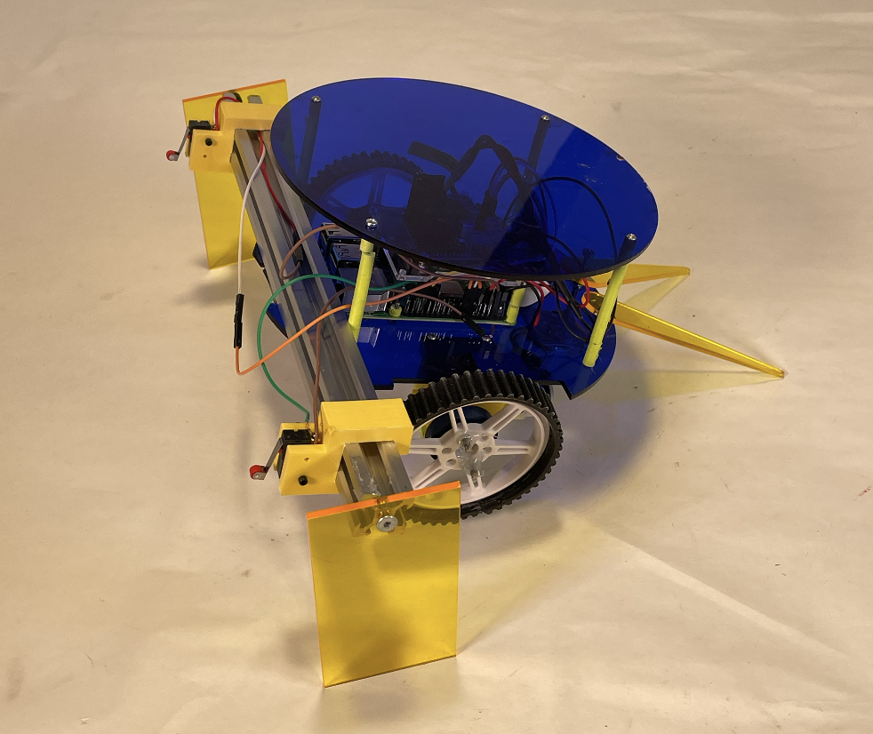
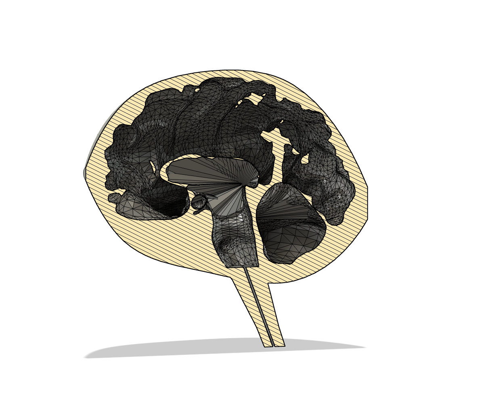

## [Portfolio](/sample_presentation.pdf)

---

### Projects

[Assistive Wheelchair Drink Holder](/drinkHolder)

---
[Wifi-Controlled Partner Robot](/pdf/sample_presentation.pdf)

---
[Fluid Simulation of Cerebrospinal Fluid](http://example.com/)

---

### Category Name 2

- [Project 1 Title](http://example.com/)
- [Project 2 Title](/pdf/sample_presentation.pdf)
- [Project 3 Title](http://example.com/)
- [Project 4 Title](http://example.com/)
- [Project 5 Title](http://example.com/)

---

---

Page template forked from <a href="https://github.com/evanca/quick-portfolio">evanca</a>

<!-- Remove above link if you don't want to attibute -->
